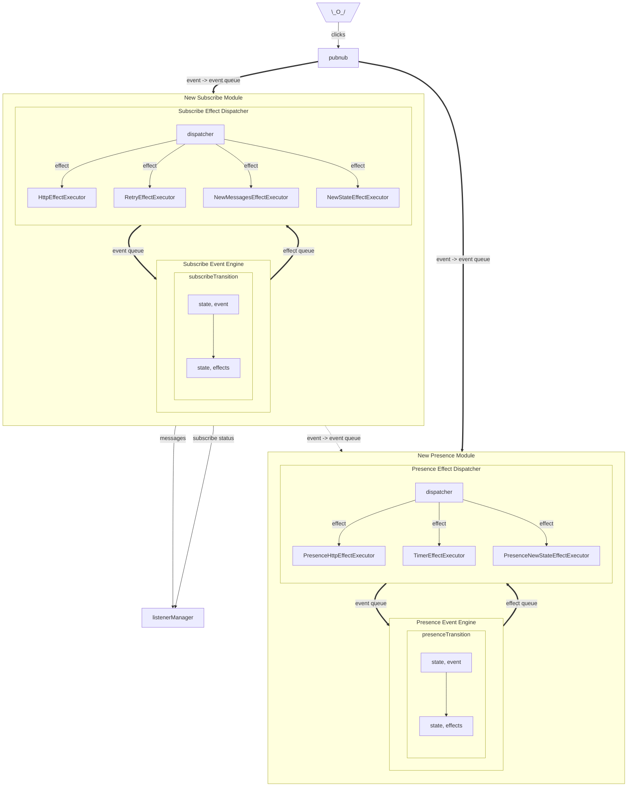

```mermaid
flowchart TB
  subgraph subscribeModule[New Subscribe Module]
      direction TB
      subgraph eventEngine[Subscribe Event Engine]
        subgraph subscribeTransition 
            state,event1[state, event] --> state,effects1[state, effects]
        end
      end
      
      subgraph effectDispatcher[Subscribe Effect Dispatcher]
            direction TB
            dispatcher -- effect --> HttpEffectExecutor & RetryEffectExecutor & NewMessagesEffectExecutor & NewStateEffectExecutor
      end
  end

  subgraph presenceModule[New Presence Module]
    direction TB
    subgraph presenceEventEngine[Presence Event Engine]
      subgraph presenceTransition 
            state,event2[state, event] --> state,effects2[state, effects]
      end
    end
    subgraph presenceDispatcher[Presence Effect Dispatcher]
      direction TB
      presenceDisp[dispatcher] -- effect --> PresenceHttpEffectExecutor & TimerEffectExecutor & PresenceNewStateEffectExecutor
    end    
    
  end

  eventEngine == effect queue ==> effectDispatcher
  effectDispatcher == event queue ==> eventEngine
  presenceEventEngine == effect queue ==> presenceDispatcher
  presenceDispatcher == event queue ==> presenceEventEngine
  user[\\_O_//] -- clicks --> pubnub
  pubnub == event -> event queue ==> subscribeModule
  pubnub == event -> event queue ==> presenceModule
  subscribeModule -- messages --> listenerManager
  subscribeModule -- subscribe status --> listenerManager

  subscribeModule -. event -> event queue .-> presenceModule
```

