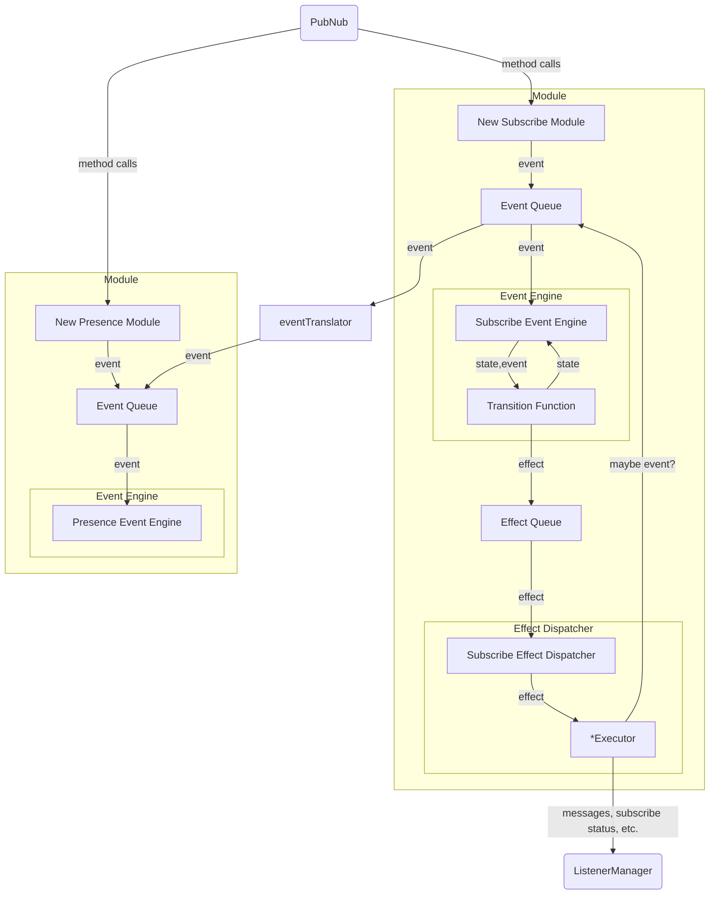

```mermaid
flowchart TB
  pubnub(PubNub)
  listenerManager(ListenerManager)
  subgraph subModule[Module]

    newSubscribeModule[New Subscribe Module]
    subgraph subEventEngine[Event Engine]
      subscribeEventEngine[Subscribe Event Engine]
      subscribeTransition[Transition Function]
    end
    subscribeEventQueue[Event Queue]
    subscribeEffectQueue[Effect Queue]
    subgraph subEffectDispatcher[Effect Dispatcher]
      subscribeEffectDispatcher[Subscribe Effect Dispatcher]
      *Executor
    end
  end

  subgraph presModule[Module]
    direction TB
    newPresenceModule[New Presence Module]
    presenceEventQueue[Event Queue]
    subgraph presEventEngine[Event Engine]
      presenceEventEngine[Presence Event Engine]
    end
  end
  eventTranslator

  
  pubnub -- method calls --> newSubscribeModule -- event --> subscribeEventQueue 
   subscribeEventEngine -- state,event --> subscribeTransition -- state --> subscribeEventEngine 
  pubnub -- method calls --> newPresenceModule
  newPresenceModule -- event --> presenceEventQueue
  subscribeTransition -- effect --> subscribeEffectQueue -- effect --> subscribeEffectDispatcher -- effect --> *Executor
  *Executor -- maybe event? --> subscribeEventQueue
  *Executor -- messages, subscribe status, etc. --> listenerManager
  subscribeEventQueue -- event --> subscribeEventEngine & eventTranslator
  eventTranslator -- event --> presenceEventQueue
  presenceEventQueue -- event --> presenceEventEngine
  
```

